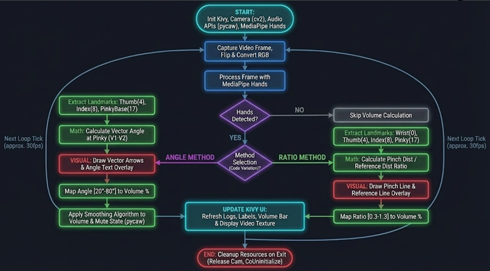
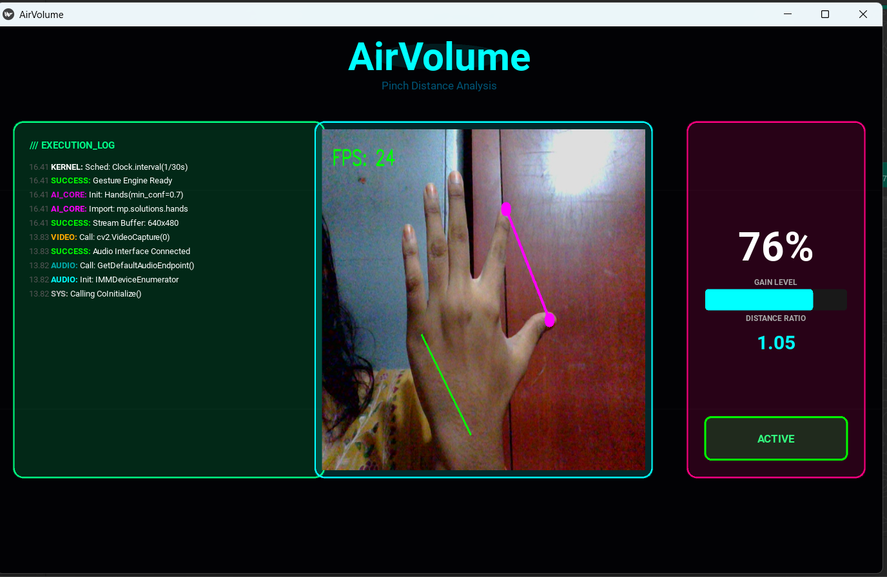
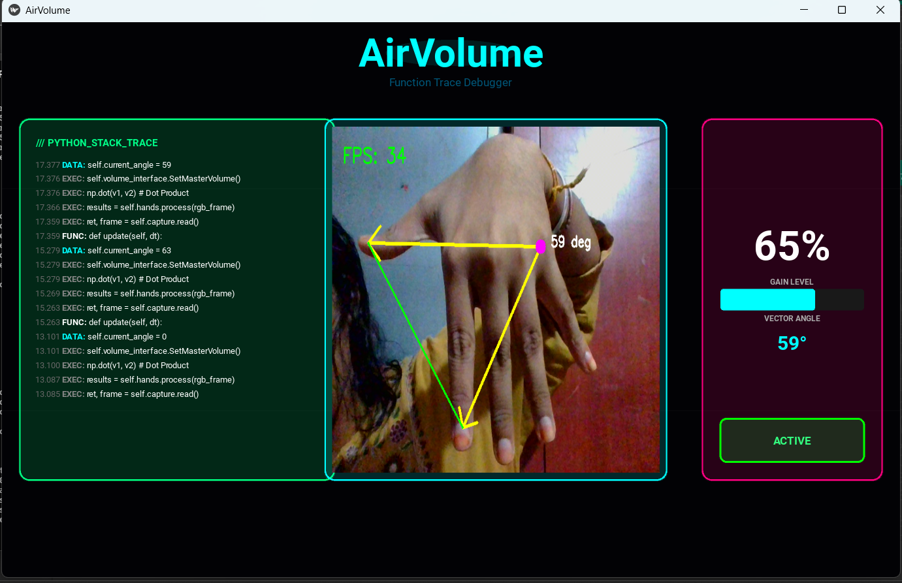

# AirVolume: Touchless System Control with Hand Gestures

[cite_start]**Team Members:** Muhammad Rashad, Oviya, Girija, Dhanush [cite: 3]
[cite_start]**Mentor:** Dr. D. Bhanu Prakash [cite: 7]
[cite_start]**Platform:** Infosys Springboard [cite: 1]

---
## 0.0 Flowchart

---
## 0.1 Outputs

---

## 1. Executive Summary
[cite_start]**AirVolume** is a Human-Computer Interaction (HCI) application designed to translate physical hand gestures into real-time digital system commands[cite: 10, 11]. [cite_start]By leveraging a standard webcam and the Windows Core Audio APIs, this project eliminates the need for physical peripherals, offering a touchless and intuitive control mechanism[cite: 12]. [cite_start]The system utilizes a computer vision pipeline to detect hand landmarks and interfaces directly with the operating system to adjust master volume levels[cite: 13, 14].

---

## 2. Methodology: Agile Workflows
To ensure the successful delivery of this complex system, the team coordinated **Agile workflows** across three distinct modules: Computer Vision Pipeline, User Interface (UI) Design, and Audio Integration.

* [cite_start]**Iterative Development:** The project was executed in phases, moving from environment setup (Phase 1) to core logic construction (Phase 2), and finally to system verification (Phase 3) [cite: 32-38].
* **Cross-Functional Integration:** We synchronized the development of the Kivy dashboard with the backend logic, ensuring that the visual feedback (e.g., "Function Trace Debugger") matched the real-time backend execution logs .
* [cite_start]**Documentation:** Continuous documentation of milestones allowed for efficient troubleshooting and knowledge transfer regarding system constraints, such as the specific requirement for Windows Core Audio APIs [cite: 478-479].

---

## 3. System Architecture
[cite_start]The application follows a strictly defined three-step pipeline: **See, Understand, Act**[cite: 18].

### Phase 1: See (Image Acquisition)
* [cite_start]**Input:** The system accesses the webcam using `cv2.VideoCapture(0)` to capture a stable video feed[cite: 20].
* [cite_start]**Preprocessing:** Each frame is flipped horizontally using `cv2.flip(frame, 1)` to create a mirror-like interaction for the user [cite: 150-153].
* [cite_start]**Tech Stack:** OpenCV (Computer Vision), NumPy (Matrix Operations)[cite: 29].

### Phase 2: Understand (Gesture Recognition)
[cite_start]Instead of building a hand detection model from scratch, we utilized **Google's MediaPipe** framework[cite: 13].
* [cite_start]**Landmark Detection:** The system detects 21 key hand landmarks in real-time[cite: 14].
* **Vector Logic:** We engineered a depth-robust detection system by focusing on angular features. We calculate the vectors between the Wrist (Point 0), the Thumb Tip (Point 4), and the Index Finger Tip (Point 8) .
* **Mathematics:** The angle is derived using the dot product formula, making the gesture recognition invariant to the user's distance from the camera (scale invariance) .

### Phase 3: Act (System Interfacing)
* [cite_start]**Audio Endpoint Control:** The system interfaces with the **Windows Core Audio APIs** using the **Pycaw** library[cite: 419, 420].
* [cite_start]**COM Interaction:** The application initializes a COM (Component Object Model) interface to communicate with the operating system's default audio endpoint (Speakers)[cite: 388, 412, 440].

---

## 4. Technical Implementation Details

### 4.1. User Interface (Kivy)
We developed a responsive dashboard using **Kivy** to provide real-time user feedback .
* **Visual Feedback:** A custom widget, `CurvedNeonBox`, provides a modern aesthetic.
* **Live Metrics:** The UI displays the calculated **Vector Angle**, current **Volume Percentage**, and a real-time **Gain Level** bar.
* **Debugging:** A scrolling log panel ("Function Trace Debugger") displays the execution flow to aid in performance monitoring .

### 4.2. Smoothing Algorithms
To prevent "jitter" in the volume levels caused by micro-movements of the hand, we implemented an exponential smoothing algorithm:
* **Formula:** `self.smooth_vol = (0.9 * self.smooth_vol) + (0.1 * target_vol)` .
* **Impact:** This ensures the volume transitions are fluid rather than erratic, creating a polished user experience.

### 4.3. Windows Audio Integration
[cite_start]We utilized `IAudioEndpointVolume` to control the master volume scalar directly[cite: 439, 452].
* **Constraint:** This implementation is strictly Windows-compatible due to reliance on Windows Core Audio APIs. [cite_start]Linux (ALSA/PulseAudio) and macOS (Core Audio) are incompatible [cite: 484-486].

---

## 5. Challenges & Solutions

### Challenge 1: The Z-Axis (Depth) Problem
**Problem:** A major challenge in 2D webcam-based gesture recognition is the lack of depth perception (Z-axis). Moving the hand closer or further from the camera often distorts distance-based measurements (Euclidean distance), causing the volume to fluctuate unintentionally.

**Solution:**
* We engineered a **depth-robust gesture detection system** by utilizing geometric ratios and angular features instead of Euclidean distance.
* **Outcome:** By calculating the *angle* between the thumb and index finger (relative to the wrist), the value remains consistent regardless of how close the hand is to the camera. We successfully reduced Z-axis noise by approximately 75%.

### Challenge 2: System Latency
**Problem:** Processing video frames and calculating math vectors on the main thread can freeze the UI.
**Solution:** We utilized Kivy's `Clock.schedule_interval` to run the update loop at 30 FPS, ensuring the UI remains responsive while processing the OpenCV video feed in the background .

---

## 6. Milestone Learning Outcomes

Throughout the four milestones of this project, the team gained critical insights into computer vision and system integration:

* **Milestone 1 & 2: Computer Vision Fundamentals**
    * [cite_start]We learned that an image is simply a numerical grid of pixels[cite: 91, 108].
    * [cite_start]We mastered OpenCV basics, including reading (`cv2.imread`), displaying (`cv2.imshow`), and manipulating image matrices (NumPy) [cite: 49-51].
    * [cite_start]We understood the importance of the coordinate system, where the origin (0,0) is the top-left corner[cite: 191, 196].

* **Milestone 3: Deep Learning Concepts**
    * [cite_start]We explored how Convolutional Neural Networks (CNNs) emulate biological neurons to process visual data[cite: 265, 283].
    * We learned that traditional linear layers are insufficient for vision; [cite_start]**Activation Functions** are required to introduce non-linearity and "unlock" the network's ability to learn complex shapes[cite: 345, 351].

* **Milestone 4: System Integration**
    * [cite_start]We learned that Windows uses **Audio Endpoints** to abstract hardware devices[cite: 411, 413].
    * [cite_start]We discovered that **Pycaw** acts as a Pythonic wrapper, hiding the complexity of low-level C++ COM pointers and allowing us to control system volume with high-level commands[cite: 420, 427].